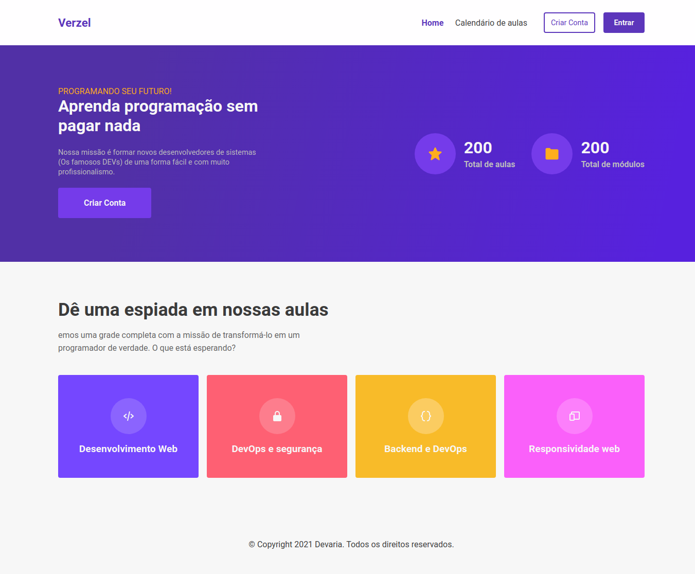

# Verzel FrontEnd

Este foi o test ou desafio que me foi proposto pela empresa Verzel a fim de testar as minhas capacidades como desenvolvedor nas linguagens `Python Django` e `ReactJs Typescript`.

A aplicação desenvolvida tem a finalidade de registrar módulos de cursos e as aulas que fazem parte do mesmo.

Aproveito mencionar que a aplicação não está responsiva tento em conta o curto prazo que tinha para entregar o projecto funcional.

Para rodar a aplicação siga os seguintes passos:

> Configurar o host da api em services

> Startar o projecto com o comando a baixo

### `yarn start`

Executar a aplicação

## Preview da aplicação

Algumas telas que a aplicação dispõe são:

- Home Page

- Aulas e Módulos

- Aulas e Módulos

Após a autenticação temos o dashboard

- Criação, deleção, actualização e listagem de módulos

Estás são algumas das telas que a aplicação dispõe.

## Funcionalidades

Os recursos funcionais da aplicação são:

- [x] Criação do Layout da aplicação
- [x] Criação, remoção e actualização de usuário
- [x] Criação, remoção, actualização e deleção de módulo
- [x] Criação, remoção, actualização e deleção de aula
- [x] Authenticação de usuário
- [x] Listagem das aulas em ordem alfabetica
- [x] Validação dos campos antes da inserção

